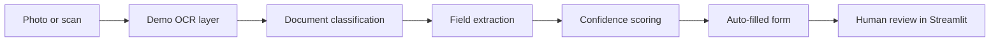
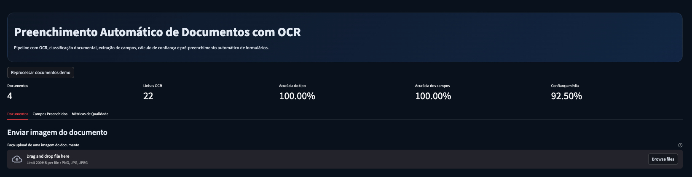
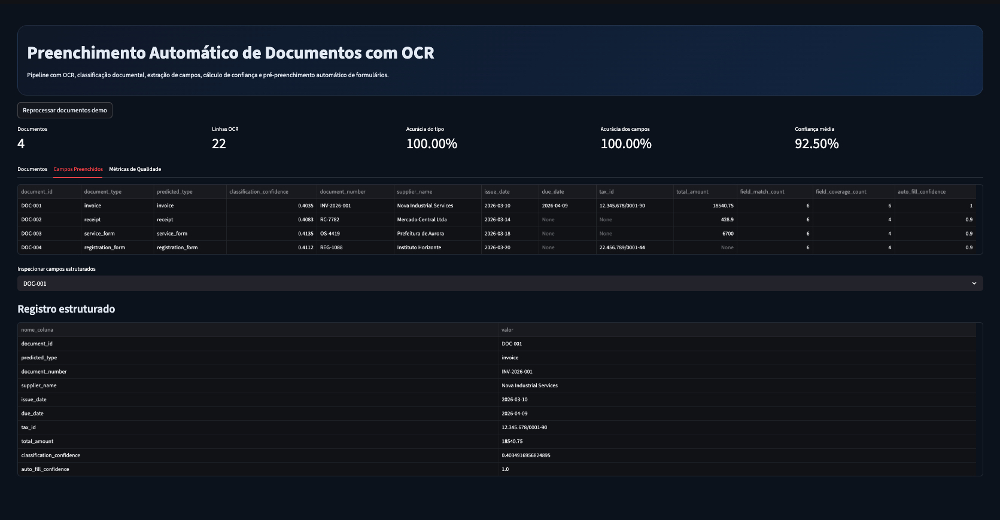

# Document Auto Fill OCR

## PT-BR

Projeto em Python para preenchimento automático de campos a partir de fotos ou scans de documentos, combinando OCR, classificação de tipo documental, extração de campos e pré-preenchimento de formulário.

### Objetivo

Simular um sistema de intake documental em que o usuário fotografa ou envia um documento e a aplicação:

- interpreta o tipo de documento
- lê o conteúdo via OCR
- extrai campos estruturados
- estima confiança por documento
- pré-preenche o formulário para revisão humana

### Caso de uso

Esse fluxo é útil para reduzir:

- erro manual de digitação
- retrabalho operacional
- tempo de cadastro
- inconsistências em documentos de entrada

### Arquitetura



### Interface





### Dados

O projeto usa uma base demo sintética com quatro tipos de documento:

- `invoice`
- `receipt`
- `service_form`
- `registration_form`

Cada documento contém:
- imagem gerada em PNG
- linhas de OCR simuladas
- ground truth estruturado

Arquivos principais:
- `data/raw/document_metadata.csv`
- `data/raw/ocr_lines.csv`
- `data/raw/documents/*.png`

### Pipeline técnico

1. `data_generation.py`
   Gera imagens sintéticas e salva os metadados do documento.
2. `ocr_pipeline.py`
   Lê as linhas de OCR simuladas.
3. `classification.py`
   Usa `TF-IDF + Logistic Regression` para classificar o tipo documental.
4. `extraction.py`
   Usa `regex` para extrair:
   - número do documento
   - fornecedor / organização
   - data
   - vencimento
   - identificador fiscal
   - valor total
5. `pipeline.py`
   Consolida métricas e artefatos finais.

### Componentes técnicos implementados

- `document generation layer`
  cria documentos visuais sintéticos com layout controlado para benchmark reprodutível.
- `ocr abstraction layer`
  separa a etapa de OCR do restante do pipeline para permitir troca posterior por motores reais.
- `document type classifier`
  usa representação vetorial de texto para inferir se o documento é `invoice`, `receipt`, `service_form` ou `registration_form`.
- `key information extraction layer`
  extrai variáveis estruturadas por padrões textuais.
- `confidence scoring layer`
  combina cobertura de campos e aderência ao ground truth da base demo para produzir um score de auto-fill.
- `human-in-the-loop interface`
  apresenta os campos pré-preenchidos em estrutura tabular para revisão.

### Técnicas e bibliotecas

- `Pillow`
  Para gerar visualmente os documentos demo.
- `pandas`
  Para estruturação dos dados e artefatos.
- `scikit-learn`
  Para classificação do tipo de documento com `TF-IDF` e `Logistic Regression`.
- `regex`
  Para key information extraction determinística.
- `Streamlit`
  Para a experiência de upload/visualização/prefill.
- `Plotly`
  Para métricas de qualidade e confiança.

Ferramentas e abordagens usadas:

- `Python`
  linguagem principal para orquestração de todo o sistema.
- `OCR simulation layer`
  usada nesta fase para manter reprodutibilidade e evitar acoplamento precoce com engines externas.
- `TF-IDF`
  para vetorização textual dos conteúdos OCR e classificação do tipo documental.
- `Logistic Regression`
  como baseline supervisionado para `document type classification`.
- `Regex-based KIE`
  para `key information extraction` determinística de campos críticos.
- `Structured tabular output`
  para apresentar os dados extraídos como uma base estruturada reutilizável por sistemas downstream.

### Variáveis estruturadas do documento

O sistema organiza os campos extraídos em formato tabular com variáveis como:

- `document_id`
- `predicted_type`
- `document_number`
- `supplier_name`
- `issue_date`
- `due_date`
- `tax_id`
- `total_amount`
- `classification_confidence`
- `auto_fill_confidence`

### Métricas atuais

- `documents_processed = 4`
- `ocr_lines = 22`
- `document_type_accuracy = 1.00`
- `field_accuracy = 1.00`
- `average_auto_fill_confidence = 0.925`
- `documents_high_confidence = 4`

### O que o projeto demonstra

- OCR pipeline para intake documental
- classificação de documentos
- extração automática de campos
- preenchimento automático orientado por confiança
- human-in-the-loop para revisão

### Uso do Codex no desenvolvimento

O Codex foi usado como acelerador de engenharia para:

- estruturar rapidamente o esqueleto do projeto
- decompor o problema em módulos (`generation`, `ocr`, `classification`, `extraction`, `app`)
- implementar o pipeline de ponta a ponta com testes
- iterar na interface em `Streamlit`
- documentar a arquitetura e os resultados técnicos

De forma honesta: o Codex acelerou a implementação do MVP, mas a definição do problema, a arquitetura do fluxo, a escolha das técnicas e o refinamento do caso de uso foram conduzidos como decisões de produto e engenharia do projeto.

### Limitação importante

Nesta primeira versão, o OCR é `simulado` a partir de uma base controlada de linhas textuais associadas a imagens sintéticas. Isso foi feito para:

- manter o projeto totalmente reprodutível
- evitar dependência de credenciais externas
- demonstrar claramente a etapa de auto-fill e validação

A arquitetura foi preparada para depois receber motores reais como:

- `PaddleOCR`
- `Tesseract`
- `Azure Document Intelligence`
- `Google Document AI`

### Como executar

```bash
python3 -m venv .venv
source .venv/bin/activate
pip install -r requirements.txt
python3 main.py
streamlit run app.py
```

---

## EN

Python project for automatic form pre-filling from document photos or scans using OCR, document classification, field extraction, and confidence scoring.

### What it does

The system simulates a document intake workflow in which a user uploads a document and the application:

- identifies the document type
- reads the text through an OCR layer
- extracts structured fields
- estimates confidence
- pre-fills a review form

### Technical stack

- `Pillow`
- `pandas`
- `scikit-learn`
- `Streamlit`
- `Plotly`

### Current demo metrics

- `4` processed documents
- `22` OCR lines
- `100%` document type accuracy
- high field extraction accuracy on the controlled dataset

### Notes

The current version uses a controlled OCR simulation so the project remains fully reproducible. The next step is plugging a real OCR engine such as PaddleOCR or Azure Document Intelligence into the same pipeline.

Codex was used to accelerate scaffolding, implementation, interface iteration, and technical documentation of the MVP.
